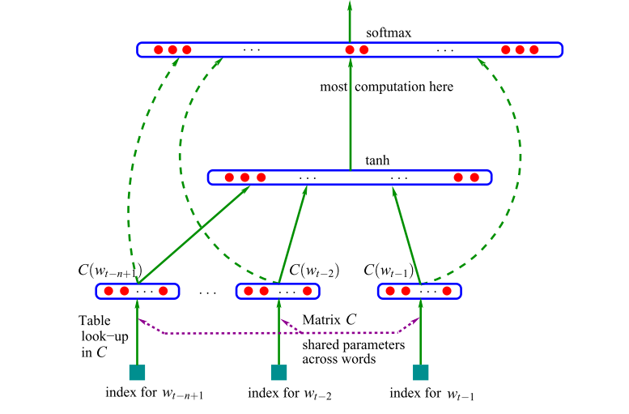

# Multilayer Perceptrons  - Character and Word Level MLPs

- MLP, following [Bengio et al. 2003](https://www.jmlr.org/papers/volume3/bengio03a/bengio03a.pdf)

This project implements character-level  Multilayer Perceptrons (MLPs) inspired by the research paper by Bengio. The aim is to predict the next character or word in a given sequence.

### Character Level MLP

For character-level prediction, a 2D embedding approach is used .
```
aaban
... ---> a
..a ---> a
.aa ---> b
aab ---> a
aba ---> n
ban ---> .
```

### Word Level MLP

The feature vector represents various aspects of each word, placing them in a vector space. The number of features, denoted as `m` (e.g., 30, 60, or 100 in the experiments), is significantly smaller than the size of the vocabulary (e.g., 17,000). The probability function is expressed as a product of conditional probabilities, predicting the next word given the previous ones. This is achieved using a multilayer neural network with parameters that can be iteratively tuned to maximize the log-likelihood of the training data. A regularization criterion, such as weight decay penalty, can be applied.

```python
import re

with open("Mahabharat.txt", 'r') as file:
    lines = file.read().splitlines()

text = ' '.join(lines).lower()
cleaned_text = re.sub(r'[^a-zA-Z\s]', '', text)

words = cleaned_text.split()

len(words)
```
```python
block_size = 3  # context length: how many words do we take to predict the next one?
X, Y = [], []

for i in range(10):
    context = words[i:i + block_size]
    next_word = words[i + block_size]
    
    context_indices = [stoi.get(w, len(itos)) for w in context]  # Use len(itos) as the default index for unknown words
    next_word_index = stoi.get(next_word, len(itos))
    
    X.append(context_indices)
    Y.append(next_word_index)
    
    print(' '.join(context), '--->', next_word)
```
```
the complete mahabharata ---> in
complete mahabharata in ---> english
mahabharata in english ---> the
in english the ---> mahabharata
english the mahabharata ---> of
the mahabharata of ---> krishnadwaipayana
mahabharata of krishnadwaipayana ---> vyasa
of krishnadwaipayana vyasa ---> book
krishnadwaipayana vyasa book ---> adi
vyasa book adi ---> parva
```
## Neural architecture


## References
 [Bengio et al. 2003](https://www.jmlr.org/papers/volume3/bengio03a/bengio03a.pdf) research paper is  inspired in this project.


## Explanation : Character Level MLP

For the character-level MLP, the goal is to predict the next character in a sequence of baby names. The process involves:

1. Character Encoding:
   - Assign key-value pairs to each character from a to z, mapping them to integers (1 to 26).
   - Include a special index (0) indicating the end of a word or sentence.

2. Data Preparation:
   - Import Torch and convert baby names into tensors using a StringToInt dictionary(stoi).
   - One-hot encode the tensor matrices for input (X) and output (Y).

3. Model Architecture:
   - Initialize an embedding matrix (C) with random values.
   - Use W1 and B1 matrices to process the input through a tanh activation function in the second layer.
   - Apply softmax embedding in the third layer to convert the output into a probability distribution.

4. Training:
   - Assign random values to the embedding matrix (C).
   - Train the model to optimize the parameters for predicting the next character.

This character-level MLP aims to capture patterns in baby names and predict the probability of the next character in the sequence.

 
