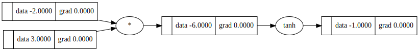

# gradDescentor - Neural Network from Scratch

Welcome to gradDescentor, a minimalist neural network implementation from scratch. This project introduces a compact Autograd engine and a concise neural networks library, showcasing the essentials of building and training neural networks without relying on external deep learning libraries.

## Features

- **Neural Networks Library:** A compact library (50 lines) offering a PyTorch-like API for constructing and training neural networks.
- **Custom Implementation:** Build neural networks from the ground up, gaining a deep understanding of the core concepts.
- **Custom Implementation:** Build neural networks from scratch without external deep learning libraries.
- **Backpropagation:** Illustrates the backpropagation algorithm for training the neural network.
- **Gradient Descent:** Utilizes gradient descent to optimize weights during training.
- **Predictions:** Once trained, the model can make predictions on new data through forward-passing.

## Getting Started

# Example Usage
```python
a = Value(-12.0)
b = Value(8.0)
c = a + b
g += 9.0 / f
print(f'{g.data:.4f}')  # prints the outcome of this forward pass
g.backward()
print(f'{a.grad:.4f}')  # prints the numerical value of dg/da
print(f'{b.grad:.4f}')  # prints the numerical value of dg/db
```

## Tracing / Visualization

 trace_graph method provides convenient graphviz visualizations. For example, the code snippet below generates a visualization of a simple 2D neuron. The resulting graph, obtained by calling draw_dot, displays both the data (left number in each node) and the gradient (right number in each node).
```python

a = Value(3.0)
b = Value(-2.0)
c = a * b
d = c.tanh()

# Visualize the graph
draw_dot(d)
```


